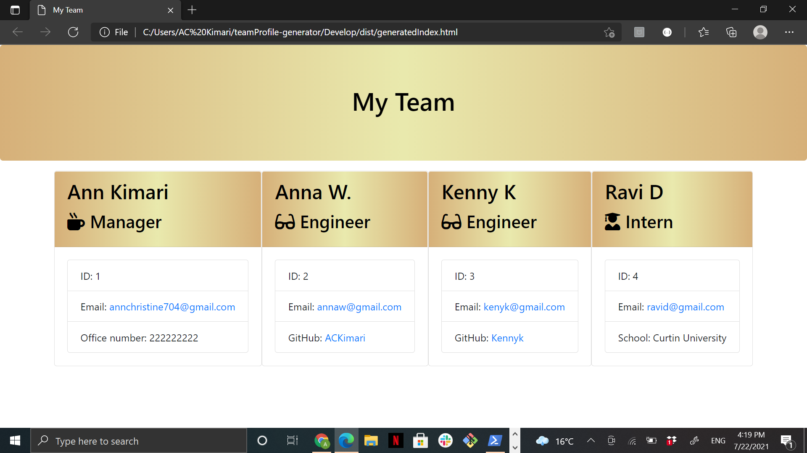

# teamProfile-generator

## Description
This project was fun and a bit complicated at first. However, once I was able to get the first parts working I instantly knew what to do after. My motivation was seeing it working. Therefore, this pushed me to complete the tasks.

The difficult part for me was understanding how to link each file to the other but once I figured out one, I was able to complete the rest.

## Installation
Step 1: Work on the Employee.js file then work on the other three within the lib folder.

Step 2: Create an index.js file within the Develop folder and look and read the generateHtml.js file carefully as it is your guide.

Step 3: link Inquirer and jest within terminal and run your tests after completing task 1 so as to make sure everything passed and begin working on your index.js file.

Step 4: create the appropriate prompted questions and test your inputs.

Step 5: generate your html file and design your work by creating a style.css file!

## Usage

## Project Video

https://drive.google.com/file/d/1gZ01wat3Ktf1UFiqmbfaN4qr_HFUM5B_/view?usp=sharing : Link to project walkthrough.